# Отчёт

## 1. Описание приложения
Просто flask приложение для создания заметок

## 2. Версии инструментов
[есть список](versions-before.txt)

## 3. Конфигурация Compose
Конфигурация готова и работает. 
Можно в файле глянуть: [link](compose-config.redacted.txt)

## 4. Запуск и проверка приложения
Мою VM в облаке не смогла запустить :( видимо ввели ограничения понятно из-за чего
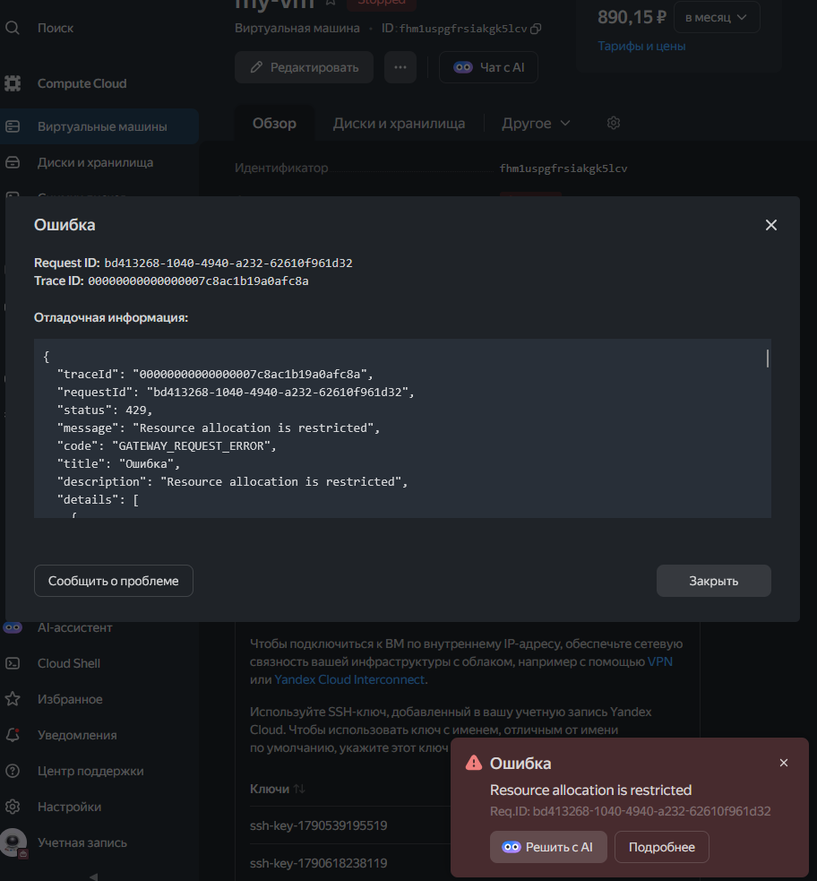

Поэтому запускаю локально пока
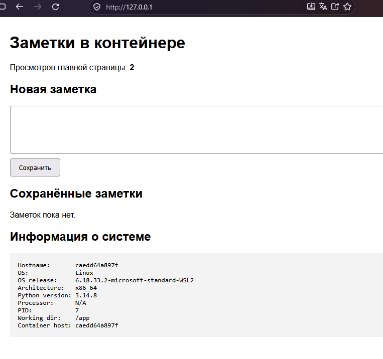

Вот healthcheck ещё
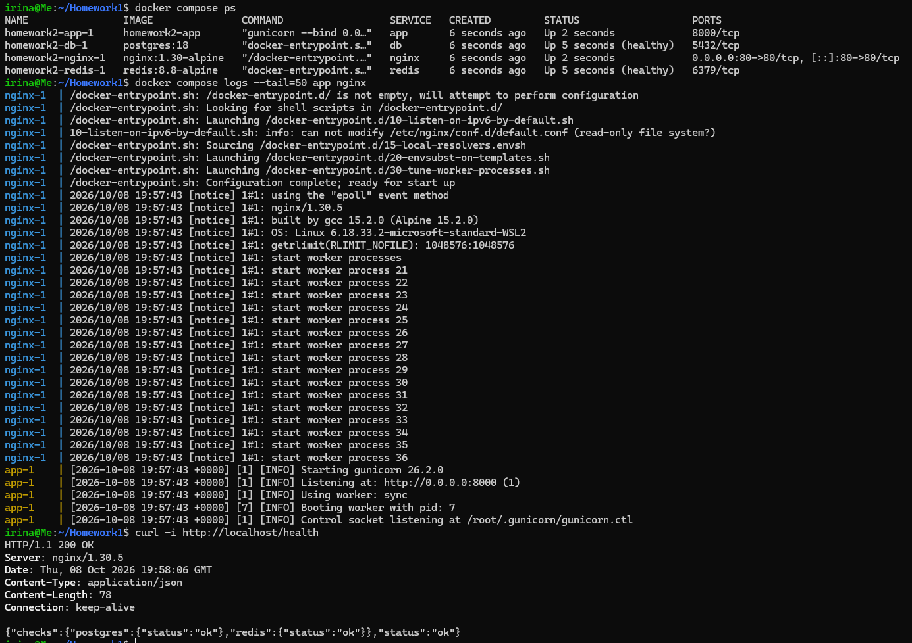

## 5. Сохранность PostgreSQL при замене контейнера
Создала контрольную заметку, потом заменила контейнер, заметка осталась той же. Т.к. именованный volume остался и новая бд использует прежние данные.
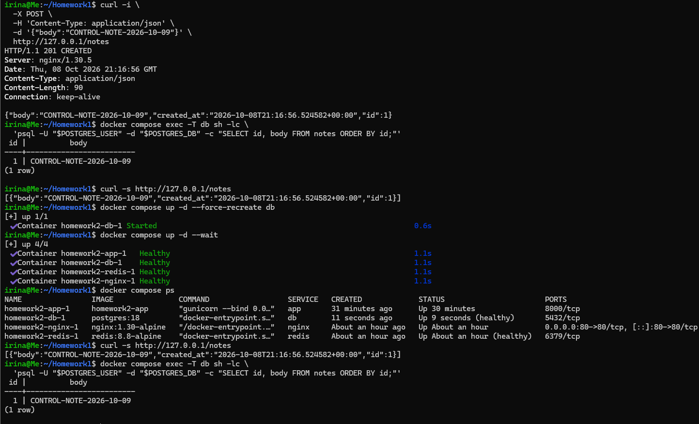

### Различие down и down -v
С обычным `down` volume остался, а контейнеры и пользовательские сети были удалены:
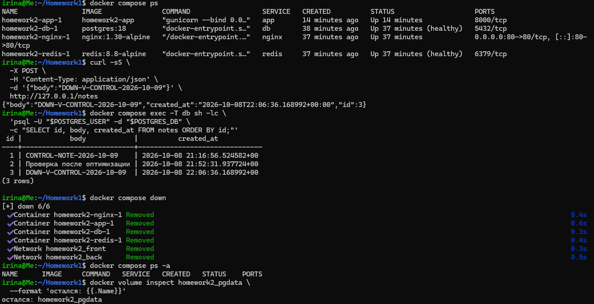
После повторного запуска стека
контрольная заметка осталась в бд:
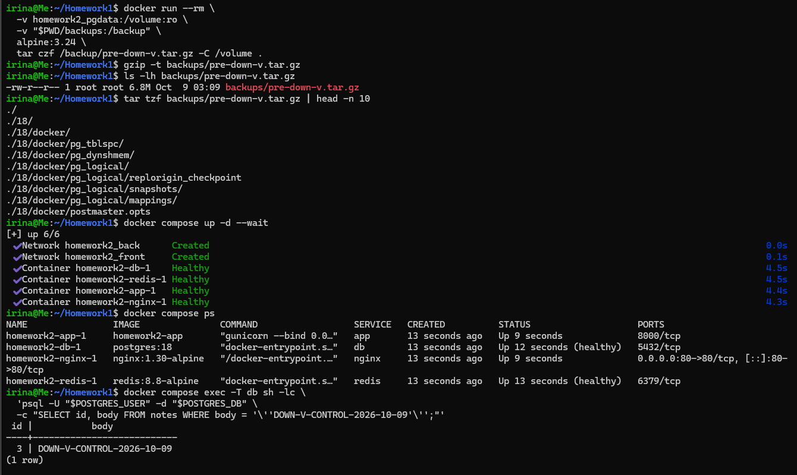


Удалила командой `docker compose down -v --remove-orphans` контейнеры и сети и именованный volume тоже. Последующий `docker volume inspect` вернул ошибку `no such volume`.
Т.к. данные были сохранены в бэкап архиве, создался новый пустой volume, а потом архив восстановился через временный контейнер. После запуска контрольная заметка опять была в бд:
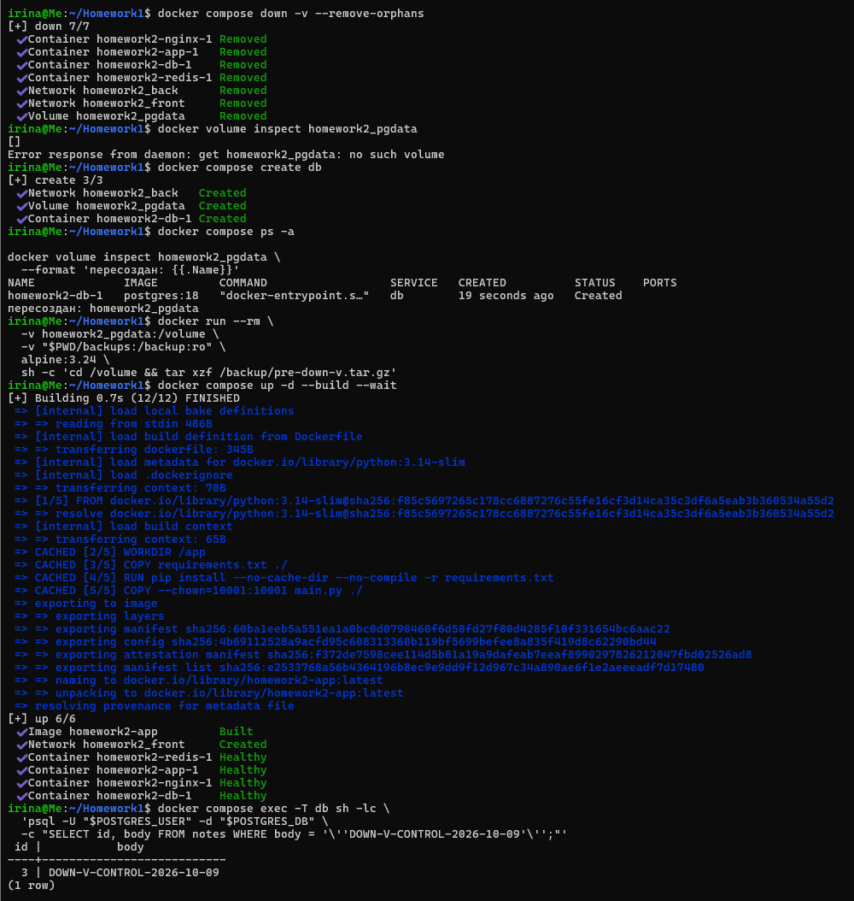

**Различие:** down сохраняет именованные volumes, а down -v
удаляет их.

## 6. Холодный backup и восстановление
volume:
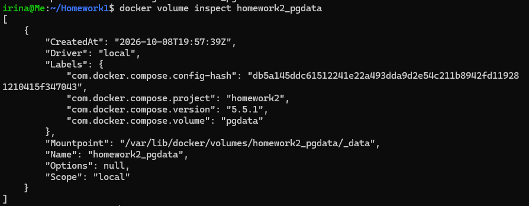

Остановила стек:
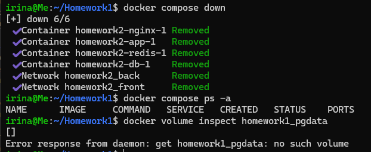

Создала архив через временный контейнер и удалила volume:
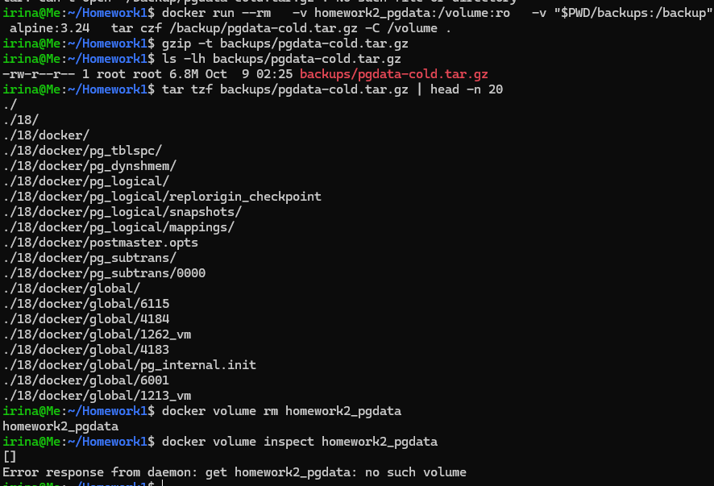

Создала новый пустой volume и контейнер бд подняла:
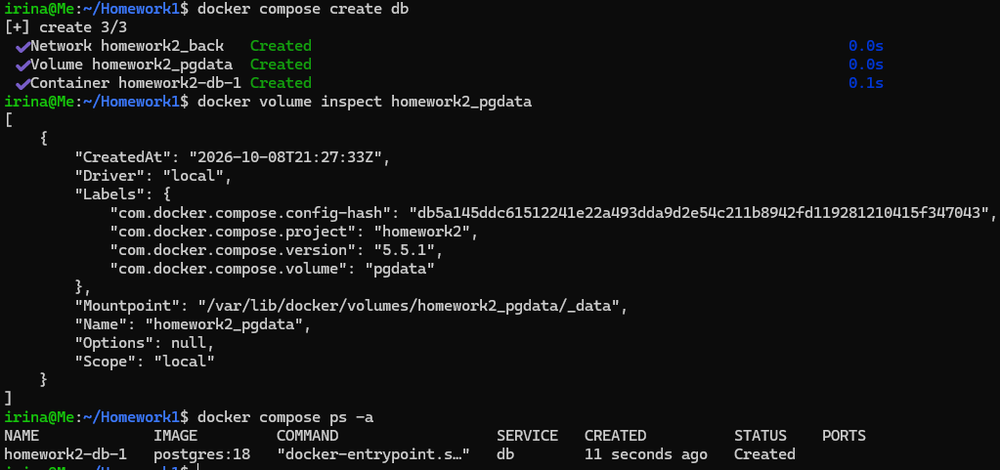

Восстановила архив, запустила с тем же образом, заметка на месте:
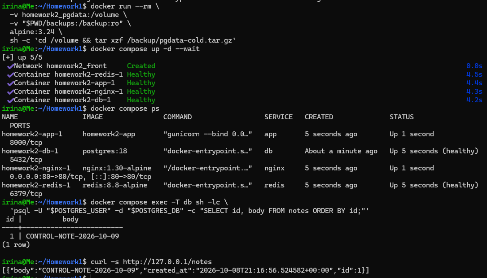

## 7. Сетевая изоляция
Просто скрин покажу
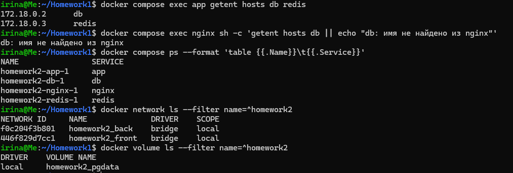

TCP подключение не работает:
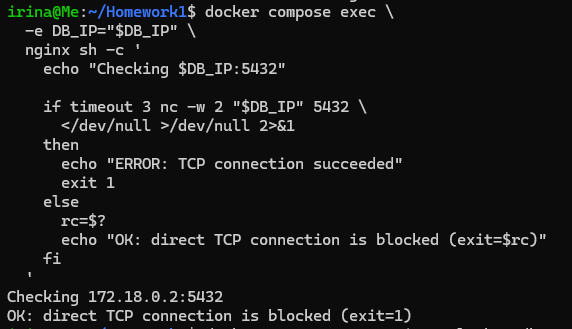

## 8. Переменные и имя Compose-проекта
Итог `docker compose config`: [link](compose-config.redacted.txt)

Имя проекта достается из `COMPOSE_PROJECT_NAME` в `.env`, а `name` из `compose.yaml` игнорируется, так как приоритет ниже.

## 9. Анализ и оптимизация образа в dive

### Анализ образа до оптимизации
Это dive с изначальным Dockerfile
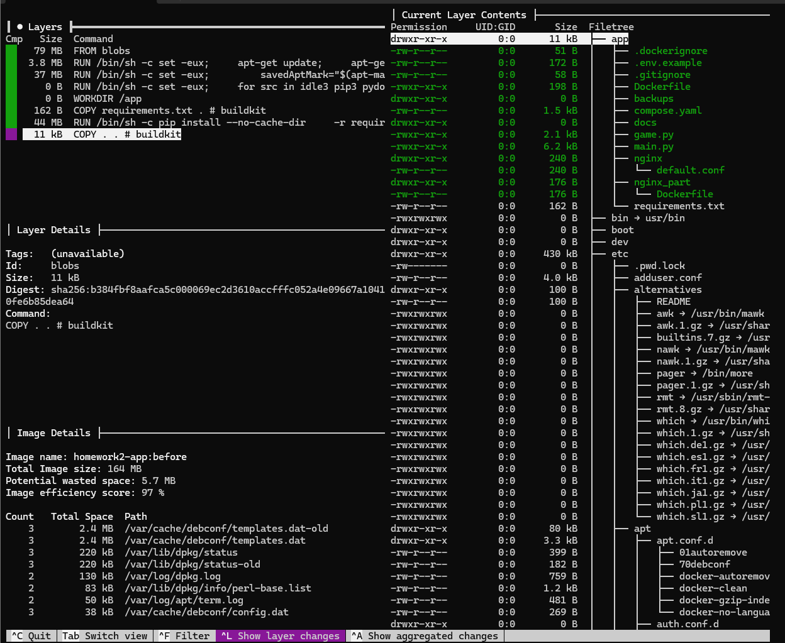

Команды:
```bash
docker build --no-cache -t homework2-app:before .
docker image inspect homework2-app:before --format 'ID={{.Id}} Size={{.Size}} bytes'
CI=true dive homework2-app:before
```

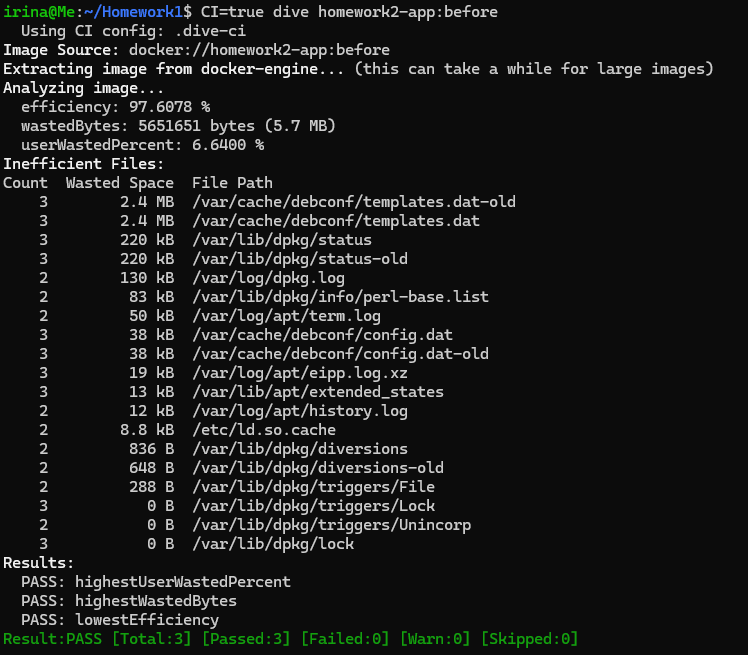

Полный вывод: [dive-before.txt](dive-before.txt).

### Анализ образа после оптимизации
В Dockerfile были выполнены следующие изменения:

- команда `COPY . .` заменена на копирование только `main.py`;
- `.dockerignore` переведён на разрешающий список из `main.py` и
  `requirements.txt`;
- при установке зависимостей добавлен параметр `--no-compile`;
- задано `PYTHONDONTWRITEBYTECODE=1`;
- приложение запускается от непривилегированного UID/GID 10001.

dive после оптимизаций:
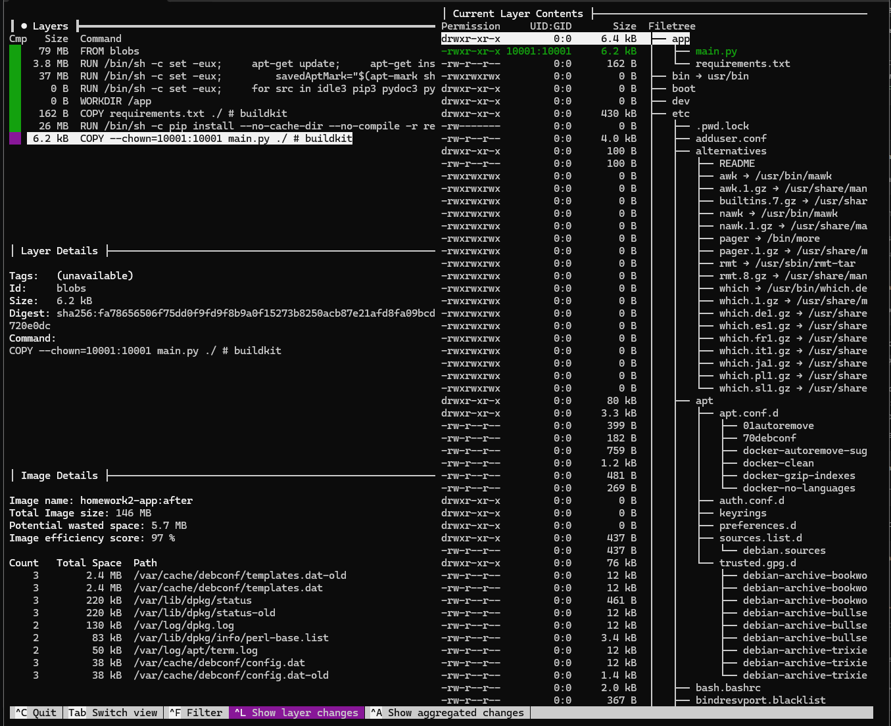

Полный вывод: [dive-after.txt](dive-after.txt).


Вынесу в табличку итоги:

| Показатель          | До оптимизации | После           |
|---------------------|----------------| --------------- |
| Размер образа       | 240343125 bytes| 212819272 bytes |
| Efficiency score    | 97.6078 %      | 97.3143 %       |
| Wasted bytes        | 5651651 bytes (5.7 MB) | 5651651 bytes (5.7 MB) |
| User wasted percent | 6.6400 %       | 8.4103 %        |
| Результат dive      | PASS           | PASS            |

Размер образа сократился с 240343125 до 212819272 байт,
то есть на 26,25 MiB, или примерно 11,45%. Основное
уменьшение достигнуто за счёт того, что в runtime-слой больше не
копируются отчёт, скриншоты, Compose- и Nginx-конфигурация
и прочие ненужные приложению файлы. `.git`, `.env`, `.venv` и `__pycache__`
были исключены через `.dockerignore` ещё в исходном варианте.

Абсолютное значение `wastedBytes` не изменилось и осталось равным
5,7 MB. Dive относит эти потери к файлам в родительских слоях
`python:3.14-slim`, например `/var/cache/debconf/templates.dat` и
`/var/lib/dpkg/status`. Эти слои не создаются Dockerfile приложения.

После уменьшения общего количества байтов те же 5,7 MB стали занимать
большую относительную долю. Поэтому `efficiency` снизился с 97,6078%
до 97,3143%, а `userWastedPercent` вырос с 6,6400% до 8,4103%.
Это не означает, что образ стал хуже: его фактический размер уменьшился,
а поведение приложения сохранилось. `PASS` означает только прохождение
заданных порогов dive, а не минимально возможный размер образа.

## 10. Очистка ресурсов

После завершения проверок удалены только ресурсы Compose-проекта
`homework2`:

```bash
docker compose down -v --remove-orphans
```

Команда остановила и удалила контейнеры `nginx`, `app`, `db` и
`redis`, сети `homework2_front` и `homework2_back`, именованный
volume `homework2_pgdata`.
